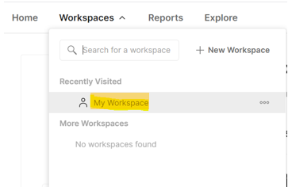
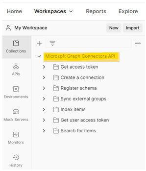
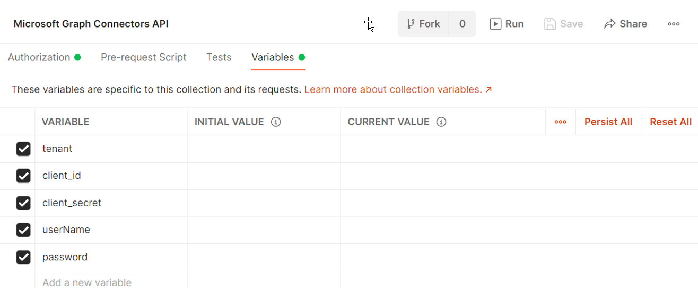
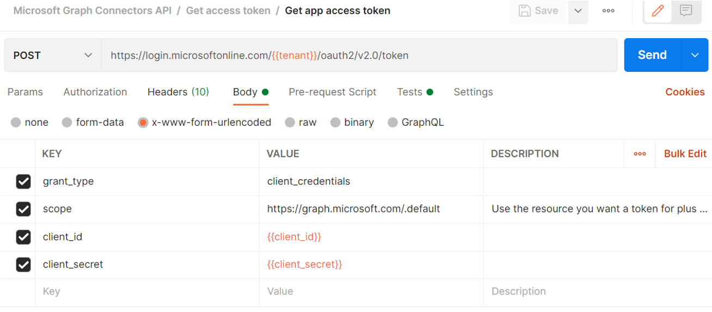
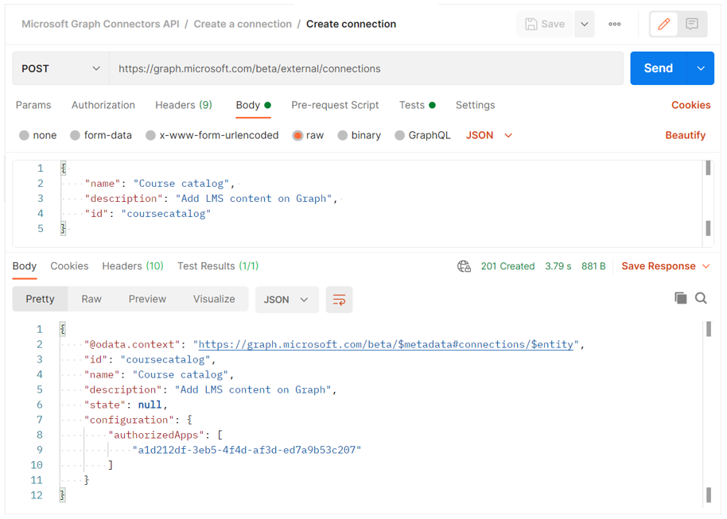
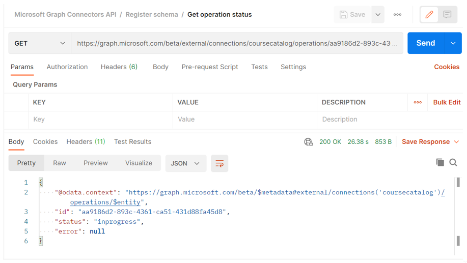

<!---
```http
```
--->
# Try Microsoft Graph connector APIs using Postman

In this topic, learn to use the Microsoft Graph connector APIs with Postman.

## Prerequisites

* Either a Microsoft account or work or school account.

* Microsoft 365 developer subscription from the [Microsoft 365 Developer Program](https://developer.microsoft.com/microsoft-365/dev-program).

## Step 1 - Import the Microsoft Graph Postman collection

To use the Postman collection, you need to import it into your Postman workspace. Do this from a web browser.

1. Go to [Postman](https://identity.getpostman.com/signup) and sign up. If you already have a Postman account, you can [sign in](https://identity.getpostman.com/login).

2. Once you sign in, go to &quot;My workspace&quot;.



3. Once you go into &quot;My workspace&quot;, select the &quot;Import&quot; button.


4. In the dialog that opens, select &quot;Link&quot; tab and enter the following URL - in the textbox:  `https://www.postman.com/collections/61bfc772fe030514b062`.


5. Select Continue.
6. Select Import.


You should now see the Microsoft graph Connectors API collection inside Postman.



## Step 2 - (Optional - Postman Web browser only) Download the Postman Agent

To use this Postman collection in your web browser, download the [Postman Desktop Agent](https://www.postman.com/downloads). You can't use Postman for the web without this due to CORS restrictions in the web browser.

Note: You don't need the agent if you're using the Postman for Windows app. If you open Postman for Windows, you will see this collection in your workspace.

## Step 3 - Create an Azure AD application

To use this collection in your own developer tenant, create an Azure AD application and give it the appropriate permissions for the requests you want to call. If you don't have a developer tenant, you can sign up for one through the [Microsoft 365 Developer Program](https://developer.microsoft.com/en-us/microsoft-365/dev-program).

1. Go to [portal.azure.com](https://portal.azure.com/) and sign in with your developer tenant administrator account.
2. Under Azure Services, select Azure Active Directory.
3. On the left menu, select App registrations.
4. On the horizontal menu, select New registration.
5. Set the Application name to **Parts Inventory**.
6. Set the Redirect URI to https://oauth.pstmn.io/v1/browser-callback.
7. Select Register.
8. On the left menu, select API Permissions.
9. In the horizontal menu, select Add a permission, Microsoft Graph, and then Delegated Permissions.
10. Start typing `ExternalItem.ReadWrite.All` and check `ExternalItem.ReadWrite.All`.
11. Select Application permissions and type User., and check Application Permissions.
12. Expand the User options and check `ExternalItem.ReadWrite.All`.
13. Select Add permissions.
14. In the horizontal menu, select "Grant admin consent for", and select Yes.
15. In the left menu, select Overview. From here, you can get the Application (client) ID and Directory (tenant) ID. You will need these in step 4.
16. In the left menu, select Certificates &amp; secrets.
17. Select New client secret, enter a description, and select Add. Copy the new client secret value, you will need this in step 4.

The Azure AD application now has permissions to make requests on behalf of a user to call ``ExternalItem.ReadWrite.All``, and as an application for ``ExternalItem.ReadWrite.All``.

## Step 4 – Configure authentication

Set up the variables in Postman. This information is used to generate the access token.

1. Select the &quot;Microsoft Graph Connectors API&quot; tab and go to the &quot;Variables&quot; section.


2. In the Variables section, provide the required information using the information from step 3.

- Set the  **Current value**  of **client\_id** to the Application (client) ID value from step 3.15.
- Set the  **Current value** of **client\_secret** to the Client Secret value from step 3.17.
- Set the  **Current value**  of **tenant** to the Directory (tenant) ID value from step 3.15.
- Set the  **Current value**  of **username** to `admin@xxxxxxx.onmicrosoft.com`
- Set the  **Current value**  of **password** to tenant admin password.



3. Select  **Save** / **Update**.

## Step 5 - Get an authentication token

You need to get an access token because this is the first time you are running a request as an application authentication flow. Get the app access token by making the following POST request:



Access token request with a shared secret:
```http
POST /{{tenant}}/oauth2/v2.0/token HTTP/1.1 //Line breaks for clarity
Host: login.microsoftonline.com
Content-Type: application/x-www-form-urlencoded

client_id={{client_id}} 
&scope=https%3A%2F%2Fgraph.microsoft.com%2F.default 
&client_secret={{client_secret}} 
&grant_type=client_credentials 

Successful response example 
{ 
    "token_type": "Bearer", 
    "expires_in": 3599, 
    "ext_expires_in": 3599, 
    "access_token": "eyJ0eXAiOiJKV1QiLCJu… " 
} 
```

Note that we are using the [client credential flow](https://docs.microsoft.com/azure/active-directory/develop/v2-oauth2-client-creds-grant-flow) here. Be sure to get app access token and not get user access token.

## Step 6 – Create a new connection

A [connection](/concepts/data-inflow-manage-connections.md) is a logical container for your external data that you can manage as a single unit. Choose a connection name, id, and description. Get the necessary details from the admin to connect to the data source and provide a mechanism to authorize against the content source when setting up the connection. You can use the [Microsoft Graph SDK](https://docs.microsoft.com/graph/sdks/sdks-overview) and APIs to program your connector setup. If you want to store credentials, you can use Azure Key Vault.

```http
POST /external/connections

Request 
POST https://graph.microsoft.com/beta/external/connections 
Content-type: application/json 

{ 
  "id": "contosotasks", 
  "name": "Contoso Tasks", 
  "description": "Connection to index Contoso task management system" 
} 

Response 
HTTP/1.1 201 Created 
Content-type: application/json 
 
{ 
    "@odata.context": "https://graph.microsoft.com/beta/$metadata#connections/$entity", 
    "id": "contosotasks", 
    "name": "Contoso Tasks", 
    "description": "Connection to index Contoso task management system", 
    "state": null, 
    "configuration": { 
        "authorizedApps": [ 
            "a47b35b7-6271-4e6d-9e27-2450a8b9c6b6" 
        ] 
    } 
} 
```

 

## Step 7 - Register connection schema

The connection schema determines how your content will be used in various Microsoft Graph experiences. Schema is a flat list of all the properties that you plan to add to the connection along with their attributes, labels, and aliases. You must register the schema before adding items into the connection.

```http
POST /external/connections/{id}/schema 

Request 
POST https://graph.microsoft.com/beta/external/connections/contosotasks/schema 
Content-type: application/json 
Prefer: respond-async 

{ 
  "baseType": "microsoft.graph.externalItem", 
  "properties": [ 
    { 
"name": "title", 
      "type": "String", 
      "isSearchable": "true", 
"isQueryable": "true", 
      "isRetrievable": "true", 
      "labels": [ 
        "title" 
      ] 
    }, 
    { 
"aliases": "creator", 
      "name": "createdBy", 
      "type": "String", 
      "isSearchable": "true", 
"isQueryable": "true", 
      "isRetrievable": "false", 
"isRefinable": "false", 
      "labels": [ 
        "createdBy" 
      ] 
    }, 
    { 
"aliases": "editedDate", 
      "name": "lastEditedDate", 
      "type": "DateTime", 
      "isSearchable": "false", 
"isQueryable": "true", 
      "isRetrievable": "true", 
"isRefinable": "true", 
      "labels": [ 
   "lastModifiedDateTime" 
] 
    } 
  ] 
} 

Response 

HTTP/1.1 202 Accepted 
Location: https://graph.microsoft.com/beta/external/connections/contosotasks/operations/616bfeed-666f-4ce0-8cd9-058939010bfc 

Note: Registering connection schema is an asynchronous operation, so do not ingest items into the connection until the connection schema is in the Completed state. To check connection schema status, execute the following request:

GET /external/connections/contosotasks/operations/616bfeed-666f-4ce0-8cd9-058939010bfc 

Request 
GET https://graph.microsoft.com/beta/external/connections/operations/616bfeed-666f-4ce0-8cd9-058939010bfc 

Response 
HTTP/1.1 200 OK 
Content-type: application/json 

{
    @odata.context":"https://graph.microsoft.com/beta/$metadata#external/connections('coursecatalog')/operations/$entity", 
    "id": "aa9186d2-893c-4361-ca51-431d88fa45d8", 
    "name": "Contoso Tasks", 
    "status": "inprogress", 
    "error": null  
}
```



Once the connection schema operation status changes from **InProgress** to **Completed,** you can ingest items for the connection.

 
 

Once the connection state changes from **draft** to **ready** , you can ingest items into current connection.


## Step 8 - Add external group member (Optional)

This step is optional. If your external service uses non-Azure AD ACLs, sync those permissions.  

External groups (along with Azure Active Directory users and groups) are used to set permissions on `externalItems` added to a Microsoft Graph connection. Use `externalGroups` to represent non-Azure Active Directory groups or group-like constructs (such as Business units, Teams, and so on) that determine permission over the content in your external data source. See external groups.

```http
Request 
POST https://graph.microsoft.com/beta/external/connections/contosotasks/groups/31bea3d537902000/members 
Content-Type: application/json 
 
{ 
  "@odata.type": "#microsoft.graph.externalGroupMember", 
  "id": "1431b9c38ee647f6a", 
  "type": "group", 
  "identitySource": "external" 
} 

Response 
HTTP/1.1 201 Created 
Content-Type: application/json 

{ 
  "@odata.type": "#microsoft.graph.externalGroupMember", 
  "id": "14m1b9c38qe647f6a", 
  "type": "group", 
  "identitySource": "external" 
} 
```


## Step 9 - Ingest Items

Once you have created a connection, you can add your content. Each item from your data source must be represented as an `externalItem` in Microsoft Graph with a unique item id. This id is used to create, update or delete the item from Microsoft Graph. You can use the primary key from your data source as the `itemId` or derive it from one or more fields. An `externalItem` has three key components: access control list, properties, and content.

If you have binary files, you must parse to get the metadata and a text version of the content. If you have non text content such as a pdf or bmp file, you must use object character recognition to convert content to text.  

You are responsible for converting your source permissions to grant or deny. Deny takes higher precedence over grant.

```http
Request 

PUT https://graph.microsoft.com/beta/connections/contosohr/items/TSP228082938 
Content-type: application/json 

{ 
  "@odata.type": "microsoft.graph.externalItem", 
  "acl": [ 
    { 
      "type": "user", 
      "value": "e811976d-83df-4cbd-8b9b-5215b18aa874", 
      "accessType": "grant", 
      "identitySource": "azureActiveDirectory" 
    }, 
    { 
      "type": "group", 
      "value": "14m1b9c38qe647f6a", 
      "accessType": "deny", 
      "identitySource": "external" 
    } 
  ], 
  "properties": { 
    "ticketID": "1158", 
    "priority": 1, 
    "title": "Filter design", 
  }, 
  "content": { 
    "value": "Build filtering capability by...", 
    "type": "text" 
  } 
} 

Response
HTTP/1.1 200 OK

```

## Error Handing

Resolve [Microsoft Graph authorization errors](https://docs.microsoft.com/graph/resolve-auth-errors).